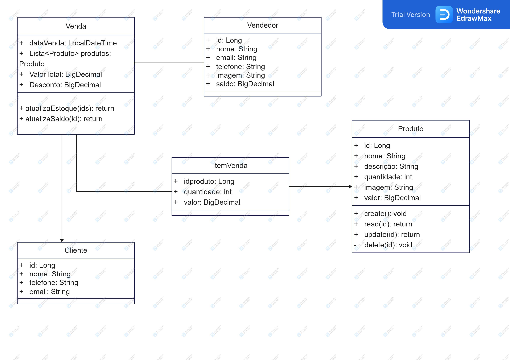

# API com arquitetura RESTful para consumo em App de vendas de produtos (vasilhas de plástico)

# Funcionalidades
* CRUD para criação, leitura, atualização e deleção dos produtos.
* Upload de imagem.
* Estoque dos produtos.
* Venda dos produtos e atualização do estoque e valores em conta.
* Login, Logout e perfil.
* Conta com os Valores das vendas.

# Vou tentar fazer mas não garanto nada kkkk
* Comprovante de cada venda.
* Carrinho de compras para fazer a venda de varios produtos de uma vez.

## Diagrama

